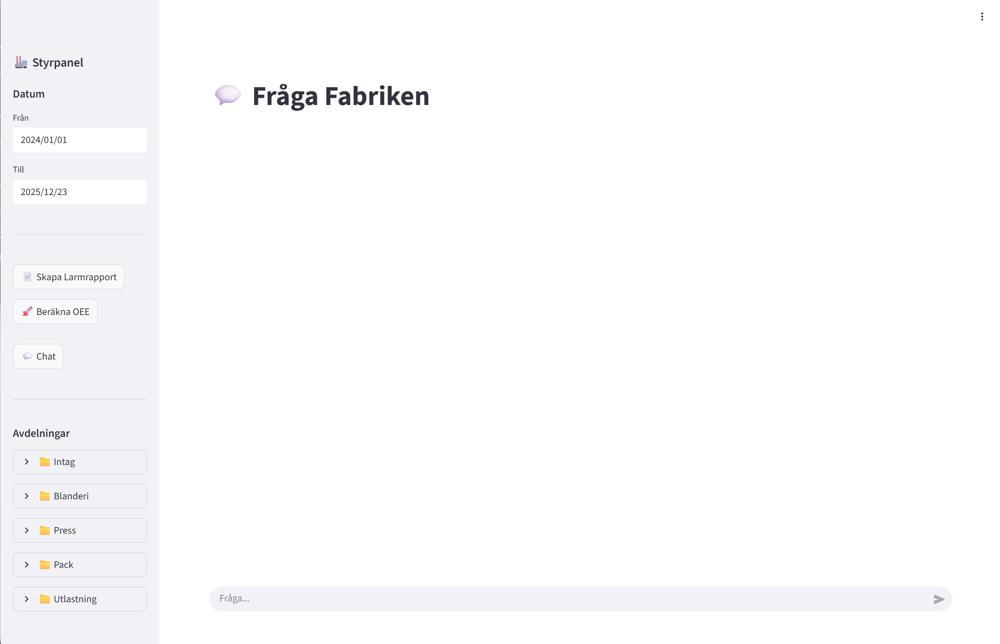
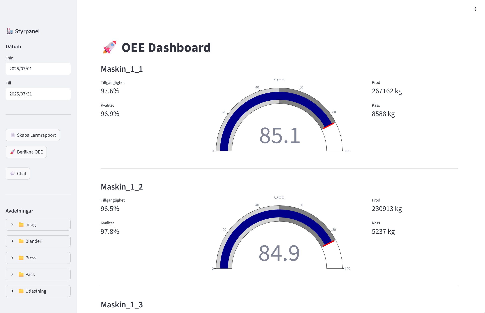
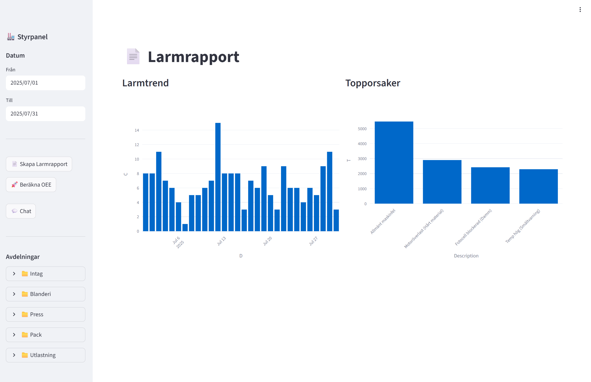
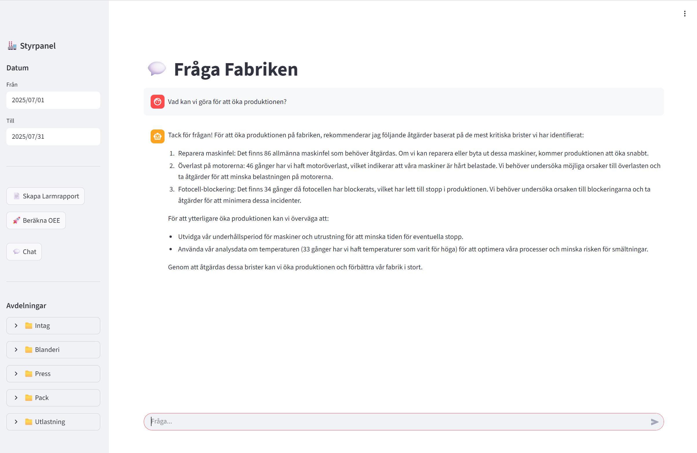
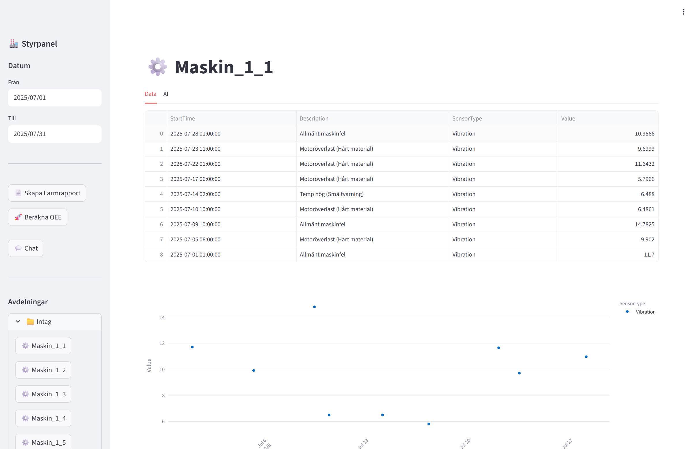

# 🏭 Godisfabrik 4.0: AI-Driven Produktions-Dashboard

[](https://opensource.org/licenses/MIT)

**AI-driven OEE & Underhålls-dashboard för en virtuell godisfabrik. Byggd med Python, Streamlit, SQL och Ollama (lokal LLM).**

## 🌟 Funktioner

*   📊 **OEE-Dashboard:** Visualisering av Overall Equipment Effectiveness (OEE) för varje maskin, inklusive Tillgänglighet, Prestanda och Kvalitet.
*   💬 **AI-driven Chat:** Fråga fabriken direkt om larm, trender, och underhållsåtgärder.
*   📈 **Dynamiska Grafer:** Automatisk generering av stapeldiagram och andra visualiseringar baserat på dina frågor.
*   📅 **Flexibla Datumfilter:** Välj perioder för att analysera larm, produktion och OEE över tid.
*   🛠️ **Maskinspecifik Analys:** Drill-down i larm och sensordata för att hitta problem och identifiera lösningar.
*   🤖 **Lokalt Körande AI:** Använder Ollama för att köra en LLM lokalt, vilket ger snabba och privata AI-analyser.
*   ⚙️ **Produktionsdata & Ordrar:** Simulera produktion, ordrar och OEE för att få en komplett bild av fabriken.

## 🚀 Kom igång (För andra användare)

För att köra denna applikation på din egen dator eller server, följ dessa steg:

1.  **Installera Docker & Docker Compose:**
    *   Du behöver ha [Docker](https://www.docker.com/) och [Docker Compose](https://docs.docker.com/compose/) installerat på din maskin.

2.  **Installera NVIDIA Container Toolkit (Om du har GPU):**
    *   Om du har ett NVIDIA-grafikkort och vill använda Ollama med GPU-acceleration, behöver du installera [NVIDIA Container Toolkit](https://docs.nvidia.com/datacenter/cloud-native/container-toolkit/latest/install-guide.html).

3.  **Klona Repot:**
    ```bash
    git clone https://github.com/<DITT_GITHUB_ANVÄNDARNAMN>/godisfabrik-ai-dashboard.git
    cd godisfabrik-ai-dashboard
    ```
    (Ersätt `<DITT_GITHUB_ANVÄNDARNAMN>` med ditt Github-användarnamn).

4.  **Skapa databasen:**
    *   Appen använder en Microsoft SQL Server-databas. Docker Compose kommer att skapa den automatiskt.

5.  **Bygg och Starta Containrarna:**
    ```bash
    docker compose up -d --build
    ```
    Detta bygger applikationen och startar alla tjänster (databas, AI, webbapp).

6.  **Ladda ner AI-modellen (Llama3):**
    *   Efter att containrarna startat, kör följande kommando för att ladda ner Llama 3-modellen (eller en annan modell som stöds av Ollama):
        ```bash
        docker exec -it godisfabrik-ai ollama pull llama3
        ```

7.  **Öppna i Webbläsaren:** Öppna din webbläsare och gå till:
    ```
    http://localhost:8501
    ```
    (Om du kör det på en server, se till att port 8501 är öppen och ersätt "localhost" med serverns IP-adress).

## ⚙️ Tekniska Detaljer

*   **Frontend:** Streamlit (Python)
*   **Backend:** Microsoft SQL Server (Docker)
*   **AI:** Ollama (lokal LLM)
*   **Datagenerering:** Python-skript som simulerar data för larm, produktion och OEE.
*   **Visualisering:** Plotly (Python)
*   **Nätverk:** Appen använder Host Mode för bästa nätverksprestanda (men se till att din brandvägg tillåter trafik).

## 📜 Licens
Detta projekt är licensierat under [MIT-licensen](https://opensource.org/licenses/MIT) - se `LICENSE`-filen för mer detaljer.

## 📸 Skärmdumpar








---
